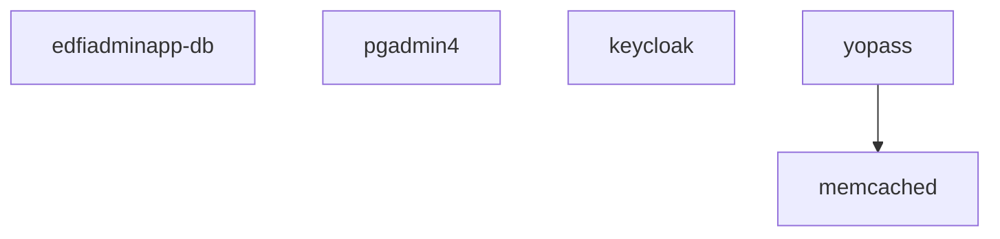
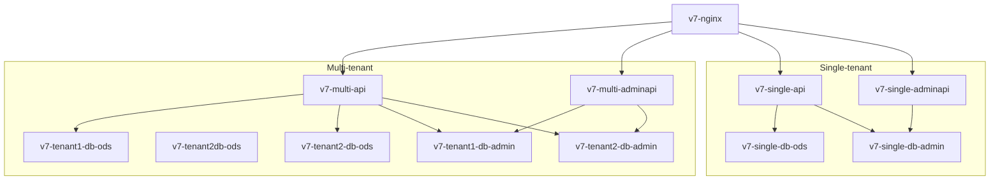
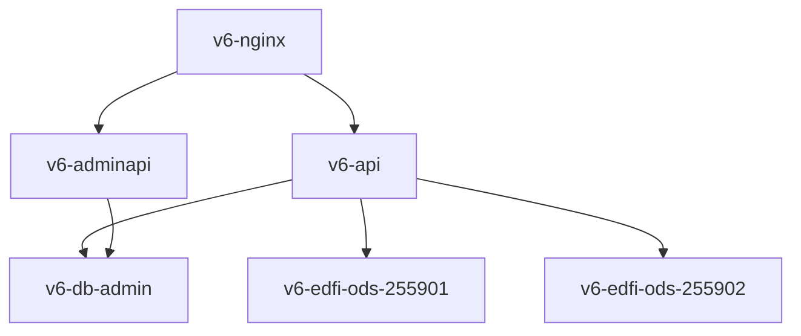

# Docker Compose Usage

## About

This directory includes a Docker Compose file for starting a collection of services needed for running and testing Ed-Fi Admin App. It includes a deployment of ODS/API 7.3 and Admin API 2.2 in multi-tenant mode, and a deployment of ODS/API 6.2 and Admin API 1.4 in district-specific mode.

### Containers for Supporting Ed-Fi Admin App



- **edfiadminapp-db**: PostgreSQL database instance for the SBAA API.
- **pgadmin4**: Standard PGAdmin4 deploy, preconfigured with links to the various PostgreSQL databases.
- **keycloak**: For user authentication.
- **yopass**: A web application for sharing one-time encrypted secrets, such as a ODS/API `client_secret`.
- **memcached**: Database supporting Yopass.

### Containers for ODS/API 7.3



- Two ODS/API instances, supporting single and multi-tenant configurations.
- The multi-tenant configuration includes two tenancies, each with own combination of "ODS" and "Admin" databases.
- **NGiNX** serves as a reverse proxy.

### Containers for ODS/API 6.2



Because this is district-specific mode, and not a multi-tenant application, both districts' setups and client credentials are in the same "Admin" database instance, even though the two districts have distinct "ODS" databases.

## Getting Started

> [!WARNING]
> For local usage, best to rely on Docker Desktop. Podman might work, but there are sufficient differences between the two that it is difficult to test and verify.

### Start Containers

There are two Docker Compose files: `docker-compose.yml` and `keycloak.yml`. This allows the developer to keep Keycloak's persistent volume while easily dropping and all other volumes, for quick reset of local development environments. Keycloak's volume can also be reset easily if desired.

1. Duplicate `.env.example` as `.env`; review the settings and customize if desired.
2. Create a self-signed certificate using script `ssl/generate-certificate.sh`, which will be used by the "gateway" container (NGiNX)
   1. TIP: Windows users can use WSL or Git-bash to run this.
3. If using PowerShell:
   - Run `up.ps1` to start all services.
   - Run `down.ps1` to shut them down again; add `-v` to drop volumes; add `-Keycloak` to drop Keycloak's volume.
4. Else:

   - Be sure to create the `logs` directory before starting services
   - And create the external `edfiadminapp-network`.

   ```shell
   mkdir logs > /dev/null
   docker network create sbaa-network --driver bridge
   ```

### Choosing a Database Template

The ODS database can use the "sandbox" or "minimal" container. When using the sandbox image, you must login to the server (e.g. using PgAdmin) and create a new `EdFi_Ods_??` database, choosing either the populated or minimal template.

### Setup Ods Instances

The ODS/API in multi-instance mode reads connection strings and routing information from the EdFi_Admin database. Currently the Admin App does not support configuring this information, so it needs to be handled manually.

Direct database insert in the single tenant `EdFi_Admin` database (be sure to replace the string "YOUR_PASSWORD")

```sql
INSERT INTO dbo.odsinstances ("name", instancetype, connectionstring)
VALUES
	('EdFi_Ods_255901', 'DistrictSpecific', 'host=v7-db-ods-1;port=5432;username=postgres;password=YOUR_PASSWORD;database=EdFi_Ods_255901'),
	('EdFi_Ods_255902', 'DistrictSpecific', 'host=v7-db-ods-2;port=5432;username=postgres;password=YOUR_PASSWORD;database=EdFi_Ods_255902');

select * from dbo.odsinstances;


INSERT INTO dbo.odsinstancecontexts (odsinstance_odsinstanceid, contextkey, contextvalue)
SELECT odsinstanceid, 'instanceid', '255901' FROM dbo.odsinstances WHERE "name" = 'EdFi_Ods_255901'
UNION
SELECT odsinstanceid, 'instanceid', '255902' FROM dbo.odsinstances WHERE "name" = 'EdFi_Ods_255902';
```

Or alternatively use Admin API: [adminapi-odsinstance.http](./adminapi-odsinstance.http)

### Setup Keycloak

1. Open [Keycloak](https://localhost/auth).
2. Sign-in with the credentials from your `.env` file.
3. Create a new realm called `edfi`.
4. Create a new non-admin client:
   1. Click on Clients.
   2. Click the Import client button.
   3. Browse to load the file `keycloak_edfiadminapp_client.json` from the `settings` directory. As a developer you will need to import `keycloak_edfiadminapp_client_dev.json` from the `settings` directory.
   4. Save.
5. Create a new user in Keycloak.
   1. Default email address: `admin@example.com`

> [!TIP]
> You can sign-in as the new user without generating a password: on the user page, click the `Action` drop down (upper right corner) and choose `Impersonate`.

### Start/Stop Admin App services

> [!NOTE]
> This step is optional for developers

- `.\up.ps1 -AdminApp` will build and start the Admin App and Admin App backend containers
- `.\up.ps1 -AdminApp -Rebuild` will rebuild (if you add new changes to the source or `.env` file) and start the Admin App and Admin App backend containers
- Run `down.ps1 -AdminApp` to shut down only the Admin App Services

The Dockerfiles, docker-compose and scripts used for this are in the `/adminapp/` folder.

## Developer Guide

See [Ed-Fi Developer's Guide](../docs/ed-fi-development.md) for troublshooting tips, and running the application for local development.

### Global Setup

If all went well, you can open [https://localhost/adminapp](https://localhost/adminapp/) with your bootstrapped initial user. This will start you in "Global scope" mode for initial configuration.

In Global Scope, complete the following setup:

- **Environments** - ❌ our first Stumbling Block - this tries to connect to AWS. Will need to replace.
- **Teams** - create a Team, name it whatever you like. More detail to come.
- **Users** - ignore for now
- **Team Memberships** - try adding yourself to the new Team, with "Tenant Admin" access.
- **Roles** - assign all `team.sb-environment.edfi-tenant.profile` privileges to the "Tenant admin" and "Full ownership" roles
- **Ownerships** - won't be able to do anything until we figure out how to create an Environment outside of AWS.
- **Sync Queue** - ignore

### URLs

These are the default URLs. The last path segment must match your environment variable settings.

- Multi-Tenant: [ODS/API 7.x](https://localhost/v7-multi-api)
  - Multi-Tenant: [Admin API 2.x in v2 mode](https://localhost/v7-multi-adminapi)
- Single-Tenant: [ODS/API 7.x](https://localhost/v7-single-api)
  - Single-Tenant: [Admin API 2.x in v2 mode](https://localhost/v7-single-adminapi)
- [ODS/API 6.x](https://localhost/v6-api)
  - [Admin API 2.x in v1 mode](https://localhost/v6-adminapi)
- [Keycloak](https://localhost/auth)
- [Yopass](http://localhost:8082)
- [PGAdmin4](https://localhost/pgadmin)
- [SBAA API Swagger](https://localhost/adminapp-api/api/)
- [SBAA UI](https://localhost/adminapp)

## Authentication Flows

The Ed-Fi Admin App supports two authentication methods:

### 1. Human User Authentication (Browser-based)

- **Config File**: `keycloak_edfiadminapp_client.json`
- **Flow**: User logs in through the browser → redirected to Keycloak → enters
  credentials → authorization code exchanged for access token → authenticated
  session established
- **Use Case**: Interactive web application access

### 2. Machine-to-Machine Authentication (API-based)

- **Config File**: `keycloak_edfiadminapp_machine_client.json`
- **Flow**: Client credentials flow for automated API access
- **Requirements**:
  - Token must include `login:app` scope
  - Audience must be `edfiadminapp-api`
  - Token verification using `jose.jwtVerify`
- **Use Case**: Automated scripts, system integrations, and service-to-service
  communication

### Testing Machine Authentication

Use the `e2e\http\machine-user-jwt-testing.http` file to test the machine-to-machine
authentication flow:

#### Setup Steps

1. **Create Client Scope**: In Keycloak Admin Console:
   - Select the `edfi` realm
   - Navigate to **Client Scopes** (in the left sidebar)
   - Click **"Create client scope"**
   - Set **Name**: `login:app`
   - Set **Description**: `Access to Ed-Fi Admin App API`
   - Set **Type**: `Default`
   - Set **Protocol**: `openid-connect`
   - Enable **Include In Token Scope**: `ON`
   - Save
2. **Import Keycloak Client**: Import `keycloak_edfiadminapp_machine_client.json` into Keycloak
3. **Update Application Configuration**: Please update the
   `AUTH0_CONFIG_SECRET_VALUE` section in the `local.js` file as shown below. If
   any configuration values are changed in
   `keycloak_edfiadminapp_machine_client.json`, make sure they match
   accordingly.

   ```js
   AUTH0_CONFIG_SECRET_VALUE: {
     ISSUER: 'https://localhost/auth/realms/edfi';
     CLIENT_ID: 'edfiadminapp';
     CLIENT_SECRET: 'big-secret-123';
     MACHINE_AUDIENCE: 'edfiadminapp-api';
     MANAGEMENT_DOMAIN: 'localhost';
     MANAGEMENT_CLIENT_ID: 'edfiadminapp-machine';
     MANAGEMENT_CLIENT_SECRET: 'edfi-machine-secret-456';
   }
   ```

4. **Create Machine User In Admin App frontend**:
   1. Open AdminApp frontend (http://localhost:4200)
   2. Navigate to Home page → Users
   3. Click "Create New" user
   4. Fill in the form:
      - Username: edfiadminapp-machine (must be unique)
      - User Type: Select "Machine" from dropdown
      - Description: "Machine-to-Machine Authentication User" (or your preferred description)
      - Client ID: edfiadminapp-machine (CRITICAL: must match Keycloak client ID)
      - Is Active: ✓ Check this box
      - Role: Select appropriate role (e.g., GlobalAdmin, GlobalViewer, etc.)
      - Add to Team: Select "Yes" if you want to assign to a team
      - If yes: Select team and role for team membership
   5. Click "Save"
      > [!NOTE]
      >
      > 1. The Client ID MUST exactly match the Keycloak client ID:
      >    edfiadminapp-machine
      > 2. The Username should be descriptive and unique
      > 3. Machine users don't need Given Name or Family Name
      > 4. Ensure "Is Active" is checked or authentication will fail
      > 5. Role assignment determines what API endpoints the machine user can
      >    access

## Troubleshooting

### Error registering OIDC provider

If the `edfiadminapp-api` container is displaying the following error in the log:

```shell
[Nest] 185  - 09/15/2025, 6:20:40 PM   ERROR Error registering OIDC provider https://localhost/auth/realms/edfi: OPError: Realm does not exist
```

- Run `down.ps1 -AdminApp` to shut them down the AdminApp services only.
- Then follow the instructions [Setup Keycloak](./readme.md#setup-keycloak).
- Start the services using the `.\up.ps1`.

> [!NOTE]
> If the error persist see the topic [Unable to connect to OpenID Connect Provider](./readme.md#unable-to-connect-to-openid-connect-provider).

### Unable to connect to OpenID Connect Provider

The initial API startup process copies the OIDC configuration from the configuration file into the database. Either follow the next steps.

- Run `down.ps1 -AdminApp` to shut them down the AdminApp services only.
- Run the script `.\settings\populate-oidc.ps1` and wait for the results. It should display the following values:

```shell
 id |               issuer               |     clientId     |  clientSecret  | scope
----+------------------------------------+------------------+----------------+-------
  1 | https://localhost/auth/realms/edfi | edfiadminapp     | big-secret-123 |
  2 | https://localhost/auth/realms/edfi | edfiadminapp-dev | big-secret-123 |
```

- The clientId we will use in Keycloak is `edfiadminapp`, so make sure the `id` match what you have in the `VITE_OIDC_ID` variable in file `.env`. In our example we have to set `VITE_OIDC_ID=1` since that one contains the right configuration
- The same value you set in variable `VITE_OIDC_ID` has to be checked in Keycloak.
  1. Open [Keycloak](https://localhost/auth).
  2. Sign-in with the credentials from your `.env` file.
  3. Select the realm called `edfi`.
  4. Go the clients and select `edfiadminapp`, make sure the `Valid redirect URIs` has the correct url included `https://localhost/adminapp-api/api/auth/callback/{your_oidc_id}`, in this case should be `https://localhost/adminapp-api/api/auth/callback/1`
- Start the services using the `.\up.ps1 -Rebuild`.
