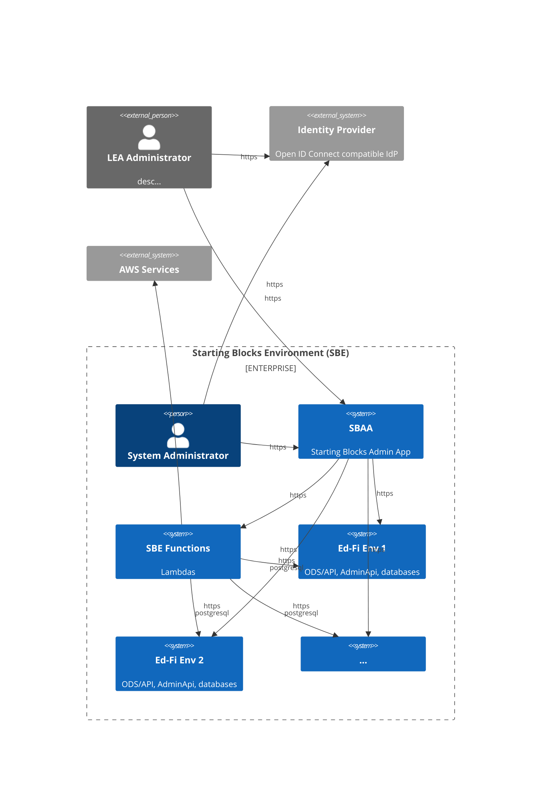
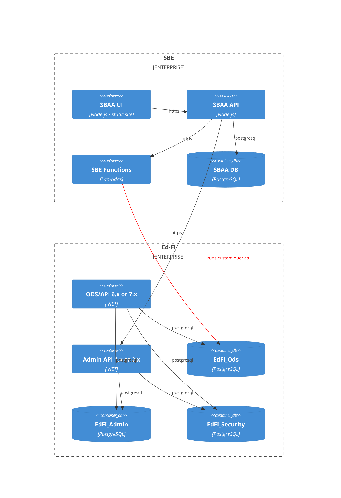

# System Architecture

## System Context C4 Diagram

The Starting Blocks Admin App (SBAA) is a centralized management system that operates within a Starting Blocks Environment (SBE) to orchestrate multiple Ed-Fi deployments. The system serves two primary user types: LEA Administrators who manage local educational data environments, and System Administrators who oversee the entire infrastructure.

The SBAA acts as a control plane that communicates with various Ed-Fi environments (each containing ODS/API, Admin API, and associated databases). It leverages AWS Lambda functions (SBE Functions) to perform automated operations across these environments, including execution of limited custom SQL commands via PostgreSQL connections.

Authentication is handled through an external OpenID Connect-compatible Identity Provider, ensuring secure access for all users. The system provides a unified interface for managing multiple Ed-Fi instances while maintaining isolation between different educational environments, enabling scalable administration of educational data systems across multiple tenants or organizations.

## System Containers C4 Diagram

For simplicity, the Containers diagram only shows a single Ed-Fi deployment. The SBAA API application serves as a dedicated backend-for-frontend (BFF) application for the SBAA user interfaces. It handles user authorization logic and various tasks. Management of the AWS environment is handled through calls to AWS Lambda functions. Wherever possible, management of the Ed-Fi deployment is handled through calls to the Ed-Fi Admin API. However, there are also Lambda functions for direct integration with the Ed-Fi databases, when the ODS/API and Admin API lack the desired functionality, or there is a clear performance benefit for the end-user. An example of the latter case: a Lambda function uses a highly optimized direct database query in the ODS for near real-time record counts.

Both the custom frontend user interface and the backend API are fully configurable. Sensitive data such as OpenId Connect provider credentials are stored in AWS Secret Manager at runtime.
